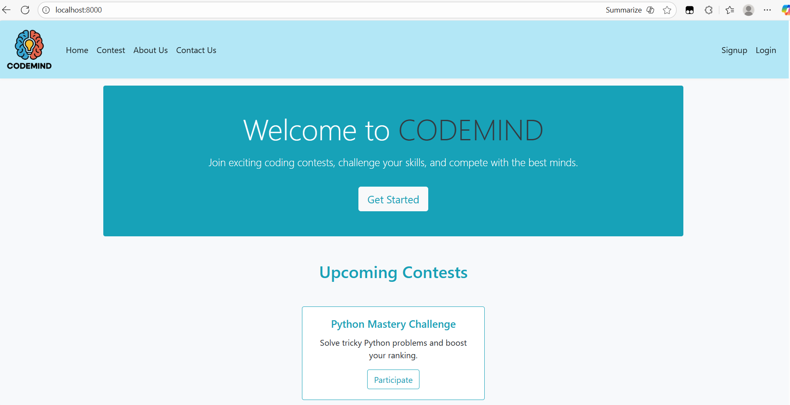
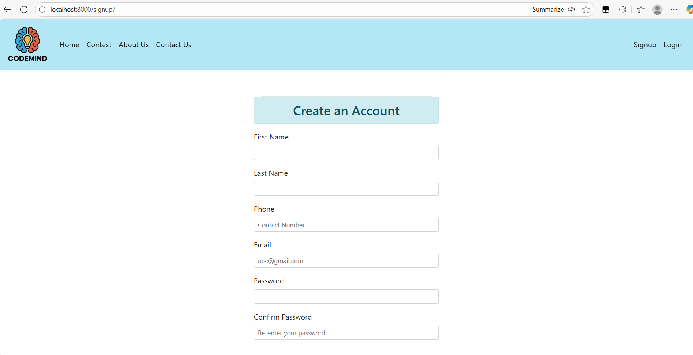
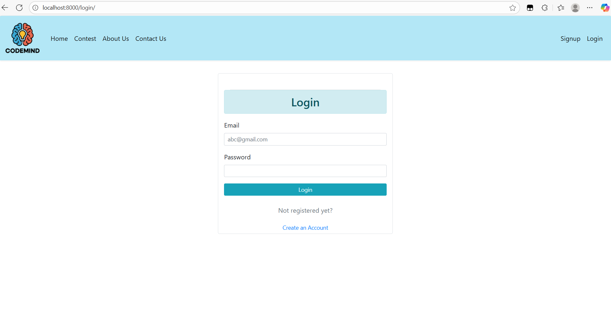
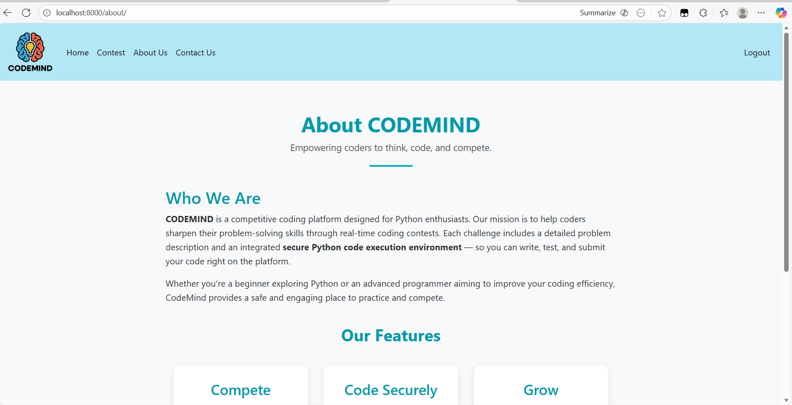
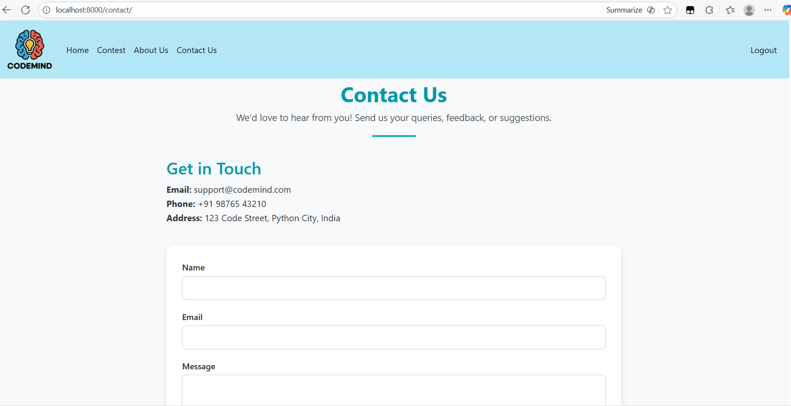
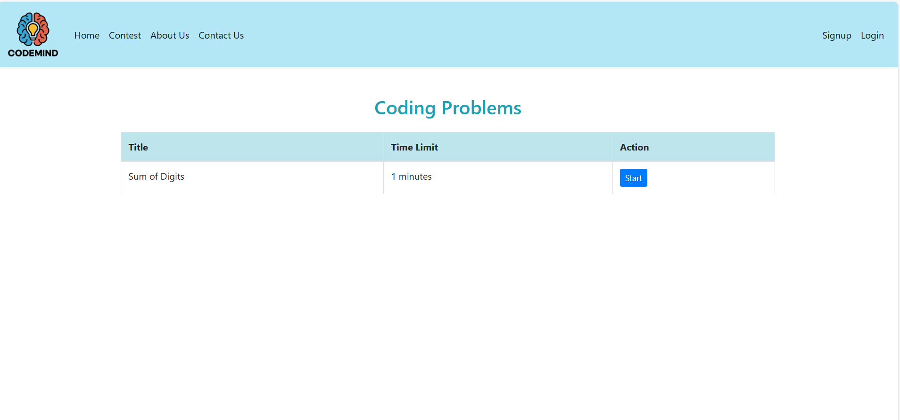
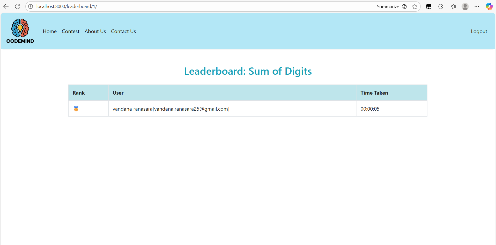
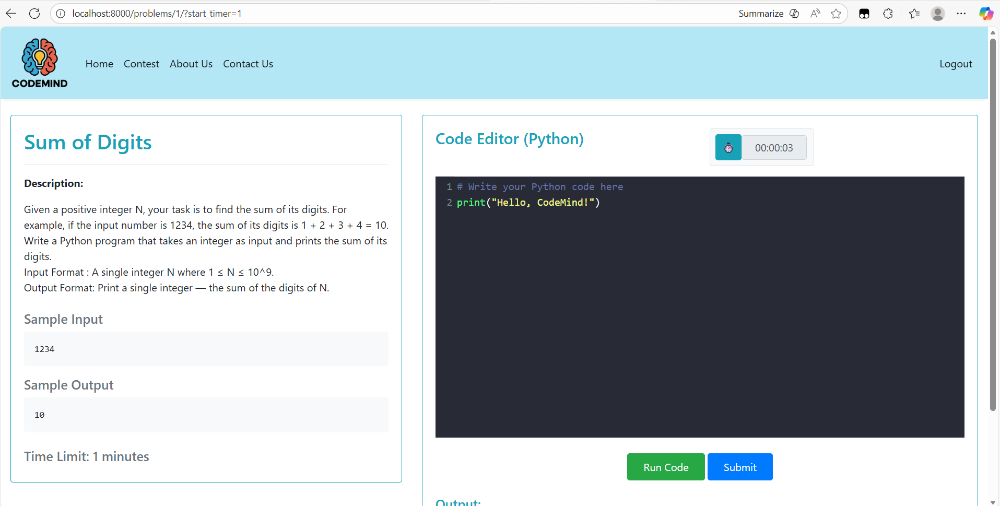

# 💻 CodeMind
CodeMind is an online platform designed specifically for Python programming contests. It allows users to participate in contests, submit solutions, and view leaderboards. The platform also provides admin control over contests, enabling smooth contest management.


# 📝 Features 

### User Features

- **Signup & Login:** Users can create an account and securely log in to access the platform.

- **Home Page:** A welcoming page with navigation to all main sections.

- **Contest Page:** Users can view all available Python contests and participate by submitting their solutions.

- **Leaderboard:** After a successful submission, users can view their ranking on the leaderboard for each contest.

- **Dashboard:** Users can track their progress, view submitted solutions, and check their performance metrics.

- **About Page:** Information about the platform and its objectives.

- **Contact Us Page:** Users can reach out to the platform team for any queries or feedback.

### Admin Features

- **Contest Management:** Admins have full control over the contest page. They can:

- Create new contests

- Update existing contests

- Delete contests


# 🛠️ Tech Stack

- **Frontend:** HTML, CSS, Bootstrap (basic styling), Javascript 
- **Backend:** Django (Python Framework)  
- **Programming Language:** Python
- **Database:** PostgreSQL
- **Other Tools:** Django Admin, Docker etc.


## 📂 Folder Structure

```
CODING_CONTEST/
│
├── coding_contest/
│   ├── __pycache__/
│   ├── __init__.py
│   ├── asgi.py
│   ├── settings.py
│   ├── urls.py
│   └── wsgi.py
│
├── contest/
│   ├── __pycache__/
│   ├── migrations/
│   ├── models/
│   ├── templatetags/
│   ├── views/
│   │   ├── __pycache__/
│   │   ├── about.py
│   │   ├── base.py
│   │   ├── home.py
│   │   ├── leaderboard.py
│   │   ├── login.py
│   │   ├── problem.py
│   │   ├── runcode.py
│   │   ├── signup.py
│   │   ├── tokens.py
│   ├── __init__.py
│   ├── admin.py
│   ├── apps.py
│   ├── serializers.py
│   ├── tests.py
│   └── urls.py
│   
├── templates/
│   ├── add_product.html
│   ├── base.html
│   ├── cart.html
│   ├── index.html
│   ├── login.html
│   ├── manage_orders.html
│   ├── orders.html
│   ├── search.html
│   ├── seller_dashboard.html
│   └── signup.html
│   
├── static/
│
├── uploads/
├── venv/
│
├── .dockerignore
├── .env.example
├── architecture_diagram
├── .gitignore
├── db.sqlite3
├── docker-compose.yml
├── dockerfile
├── manage.py
└── requirements.txt
```

# 🚀 How to Run the Project

Follow these steps to set up and run the project on your local system:

### 1️⃣ Clone the Repository
- Clone the project from GitHub using:
 ```bash
git clone https://github.com/vandanaranasara/CODEMIND.git
cd CODEMIND
```

### 2️⃣ Create a Virtual Environment
```bash
python -m venv venv
```
- Activate the Virtual Environment
```bash
venv\Scripts\activate
```

### 3️⃣ Install Dependencies
```bash
pip install -r requirements.txt
```

### 4️⃣ Run Database Migrations
```bash
python manage.py makemigrations
python manage.py migrate
```

### 5️⃣ Create a Superuser
```bash
python manage.py createsuperuser
```

### 6️⃣ Run the Development Server
```bash
python manage.py runserver
```

Open your browser and go to:
- http://127.0.0.1:8000/
  
Admin panel:
- http://127.0.0.1:8000/admin/

## 🐳 Docker Setup

Follow these steps to set up and run the project using Docker :

### 1️⃣ Clone the Repository
- Clone the project from GitHub using:
 ```bash
git clone https://github.com/vandanaranasara/CODEMIND.git
cd CodeMind
```

### 2️⃣ Create a Virtual Environment
```bash
python -m venv venv
```
- Activate the Virtual Environment
```bash
venv\Scripts\activate
```

### 3️⃣ Install Dependencies
```bash
pip install -r requirements.txt
```

### 4️⃣ Stop Containers (if running)
```bash
docker compose down
```
### 5️⃣ Build and Start Containers
```bash
docker compose up --build
```

Now open your browser and go to:
Open your browser and go to:
- [http://localhost:8000](http://localhost:8000)
  
Admin panel:
- [http://localhost:8000/admin](http://localhost:8000/admin)

## 📸 Screenshots

| Homepage | Signup | Login |
|-----------|------------|------------|
|  |  |  |

| About Us | Contact | Contest |
|-----------|------------|------------|
|  |  |  |

| Leader_board | Problem_details |
|------------|------------|
|  |  |


## 👥 Contributor

- [Vandana Ranasara](https://github.com/vandanaranasara)


